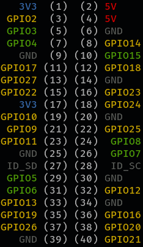

<h1 align="center">GPIO Print for Raspberry Pi</h1>
<p align="center">A small command line tool to print the current status of GPIO pins.</p>
<p align="center">
   <a href="https://github.com/fgrosse/gpio-print/releases"></a>
   <a href="https://github.com/fgrosse/gpio-print/actions/workflows/test.yml"></a>
   <a href="https://github.com/fgrosse/gpio-print/blob/master/LICENSE"></a>
</p>

---

### Usage

You can run `gpio-print` without any arguments to print a colored overview of
the GPIO pins. The output is similar to the one at the bottom of the `pinout`
command.

For the GPIO pins, green coloring means the pin is set to HIGH, while yellow
coloring means it is set to LOW. 



You can use the `-w` flag in order to continuously watch the pins.  

```bash
$ gpio-print -h
Usage of gpio-print:
  -w	watch mode
```
